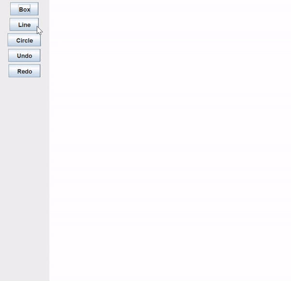

# Simple-Paint
Draw Circle, Box and Line and options to undo and redo. 
When the application starts, it displays a window containing four buttons and a drawing area called canvas.
The buttons are labeled “Line,” “Box,”, "Circle", “Undo” and “Redo,” respectively. When any of the shape buttons is
clicked, and then the mouse is pressed in the canvas, the corresponding shape is drawn in the canvas at the
location clicked. When the Undo or Redo button is clicked, the last shape is removed or redrawn.

The application is designed and implemented in Java and apply the following patterns:
1. Controller
2. Expert
3. Observer (e.g., Java ActionListener API)
4. Adaptor
5. Iterator
6. Composite
7. Command

